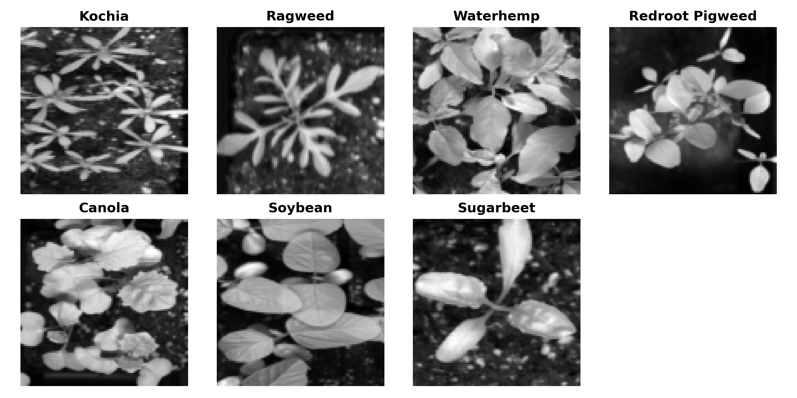
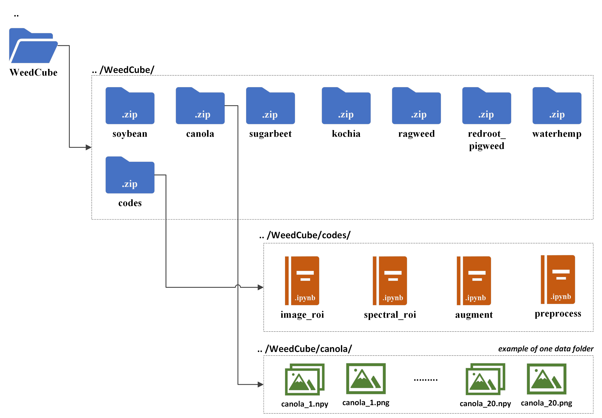

# WeedCube
WeedCube: Proximal Hyperspectral Image Dataset of Crops and Weeds for Machine Learning and Deep Learning.

## Value of Data
<ul>
  <li>The WeedCube dataset comprises hyperspectral images of three crops (canola, soybean, and sugarbeet) and four weeds (kochia, common ragweed, redroot pigweed, and common waterhemp). This data, offering both spatial and spectral information, is suitable for image or spectral based data analysis pipelines.</li>
  <li>Accompanying the dataset are Python scripts, saved as Jupyter notebooks, which enable viewing of pseudo RGB images from the three-dimensional (3D) data cube, plotting of spectral plots, extraction of regions of interest (ROI) as image or point spectral data, and application of data augmentation.</li>
  <li>The data collection for the WeedCube dataset took place in two different greenhouse located in North Dakota, USA, under controlled lighting conditions. The images captured represent various growth stages of the plants, subsequent to their vegetative phase.</li>
  <li>The dataset can serve as input for machine learning (ML) and deep learning (DL) models, following multivariate data analysis and statistical modelling.</li>

  <li>The dataset can be utilized for the development and tuning of ML and DL models that work with 3D data. It can also be used to address issues such as data compression, large data transfer, system memory exhaustion associated with high-dimensional data, preprocessing, feature selection, and the creation of data pipelines for large datasets.</li>

  <li>The dataset can add to the existing weed classification or identification datasets by increasing the number of training samples, serving as testing data to validate model performance, and aiding in the resolution of model overfitting for better model generalization.</li>

  <li>Given the multi-dimensional nature of hyperspectral images, their wider adaptability is currently limited. Our objective is to make the WeedCube dataset open source, thereby providing access to a larger community that might not have the resources to collect such data, facilitating its use for research and educational purposes.</li>

</ul>

<figure>
  
  <figcaption>Fig.1 - 3D hyperspectral data in the WeedCube dataset.</figcaption>
</figure>

<figure>
  
  <figcaption>Fig.2 - The WeedCube dataset's directory structure, showcasing the organization of hyperspectral images in individual folders and Python scripts for image processing, data augmentation, and ROI selection. Each individual plant folder contains .npy hyperspectral data and .png pseudo RGB image for quick visualization.</figcaption>
</figure>

# Important Links
WeedCube Dataset DOI: https://doi.org/10.15482/USDA.ADC/25306255.v1  
WeedCube Paper DOI: https://doi.org/10.1016/j.dib.2024.110837

### If you use this dataset or the codes provided. Kindly cite the author as:
Ram, B. G., Mettler, J., Howatt, K., Ostlie, M., & Sun, X. (2024). WeedCube: Proximal Hyperspectral Image Dataset of Crops and Weeds for Machine Learning Applications. Data in Brief, 110837, https://doi.org/10.1016/j.dib.2024.110837.

